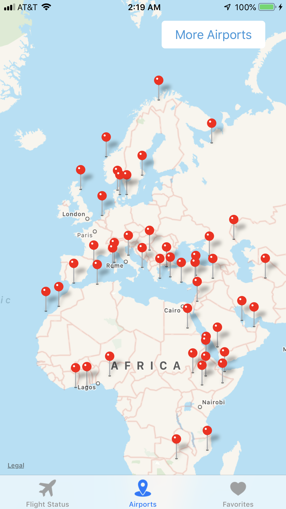
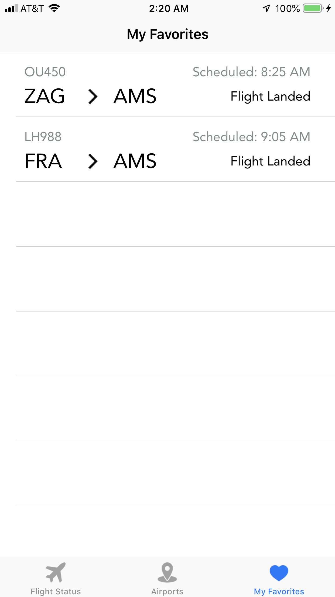
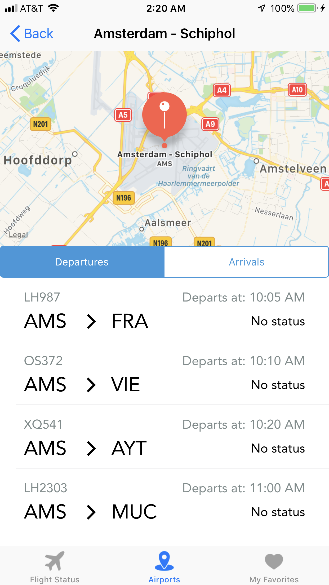

# MDB Socials Part 2

## Description
Welcome to the Lufthansa Flight Tracker Application. This application offers the ability to track all flights operated/held by Lufthansa. Using their API, users can look at specific flight details by flight number or by airport. Additionally, they can favorite them for quick reuse later.

## Screenshots

|         |            |   |
| :-------------: | :-------------: | :-------------: |
| Search by Flight, | Airport, | or favorite! |

|         |            |
| :-------------: | :-------------: |
| View Flight Details | Find flights by airport |
